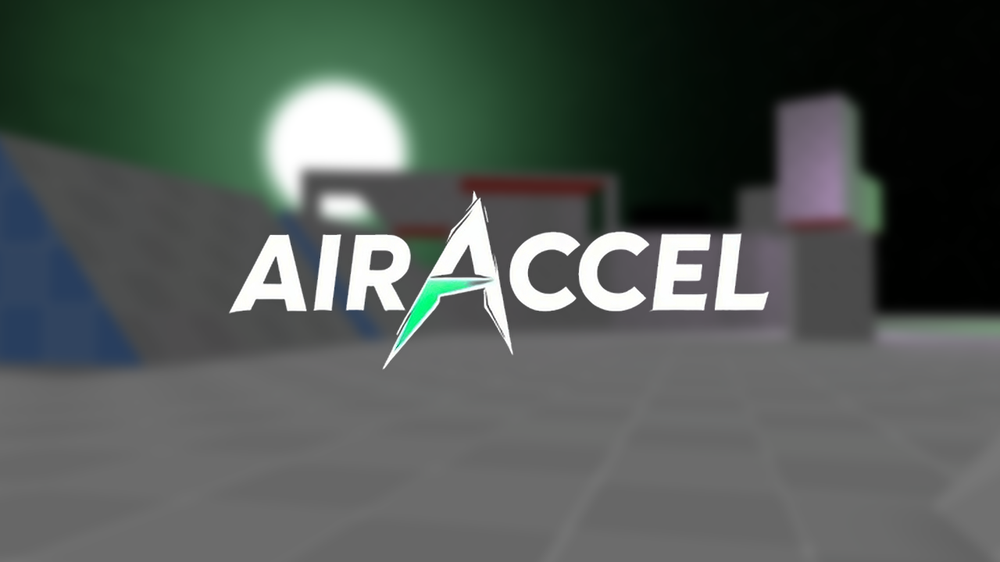

## What is this?

Bunnyhop and surf have historically been difficult to find and difficult to play.  Connecting to surf & bhop servers in Counter Strike or Garrys Mod is not intuitive.  Then, once new players do happen to stumble upon bhop or surf, it's mechanically difficult and unintuitive to learn and play.  Most people leave before they figure it out!

AIRACCEL's mission is accessibility.  We're going to solve those two problems.

## What else?

Bunnyhop and surf have thrived for a very long time thanks to the passion of its community.  We want to continue that, and give creators the tools they need to build awesome maps.  Graybox is a modern level editor designed for [Fragsurf](https://store.steampowered.com/app/1033410/Fragsurf/) and AIRACCEL.  Graybox will be open sourced as well at a later date.

## Contribute

Contribution guidelines will be posted later.

## Roadmap

Roadmap will be posted later.
